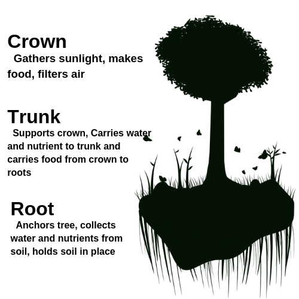
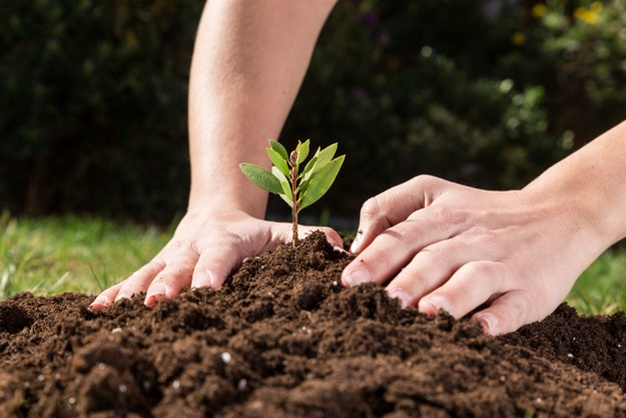
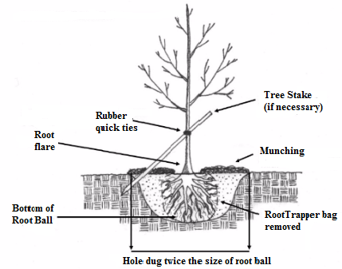

==============================
Chapter 3: Tree and its Growth
==============================

In the previous chapter, we explained how to set up a Django project and run the
Django development server. In this chapter, you'll learn the basics of creating
dynamic Web pages with Django.

|
|

Importance of trees
===================
    | 1) First of all, Trees provides wood on base of which carpentry stands.
    |
    | 2) **There are various trees used for their medicinal properties.**
    |
    | 3) Trees absorbs the atmospheric carbon dioxide which slows global warming and gives out oxygen to support animal life.
    |
    | 4) **Trees makes place beautiful and helps to minimize sound pollution.**
    |
    | 5) Trees hosts complex ecosystem giving habitat to microbes, insects, lichen, fungi, birds, reptiles, indigenous peoples and other mammals.
    |
    | 6) **They store carbo, aid in regulating the climate, purify water and mitigate natural hazards like floods, landslides and desertification. Forests also contains roughly 90 percent of the world's terrestrial biodiversity.**
    |
    | 7) Trees boosts economy by means like fruits, rubber, ropes, medicines, paper, pencils, incense, oil, tourism and so on.
    |
    | 8) **Trees are only source of starch food for animals.**

   	Figure 3-1. A tree

|
|
|

Enemies of tree
===============
.. code-block:: console

    1) Insects

    2) Diseases

    3) Fire

    4) Natural disasters like storms, landslide, earthquake, lightening and so on

    5) Deforestation

|
|
|

Conservation of forest
======================

    | 1) Development of programs which harmonize conservation of forests like controlled deforestation.
    |   
    | 2) **Precautions should be considered to fight against Forest fires by making fire lanes, chemicals to control fires, clearing dry leaves and trees and awareness among people.**
    |
    | 3) Afforestation should be prioritized.
    |
    | 4) **Effective rules and regulation should be formulated and make sure of its strict practice to counter problems like deforestation and use of forest area for non-forest purposes.**
    |
    | 5) Awareness among people through mass media, street shows and books.

|
|
|

Plantation of a tree
====================
Planting a tree is a lifelong investment. Plantation of a tree depends on type of tree selected, weather condition, selection of planting location and care provided during and after the plantation.

   	Figure 3-2. Plantation of a tree

The steps of planting a tree are as follows:

| 1) **Prepare all the utilities required for planting a tree.**
|
| 2) Dig a shallow, broad planting hole which should be only deep as the root ball and twice or thrice time wider than the root ball.**
|
| 3) **Then, remove the containers which holds the root ball and inspect it to straighten, cut or remove the circling roots.**
|
| 4) Place the tree straight in the hole by viewing from all directions confirming it is placed straight.
|
| 5) **Now, fill the hole gently and firmly to stabilize the base of root ball. Fill the remaining hole with soil to eliminate air pockets which could dry out roots.**
|
| 6) Stake the tree, if necessary. Because if the tree is not staked while planting, tree grows more quickly and develop stronger trunk and root systems.
|
| 7) **Mulch the base of the tree which involves placing materials or soil over the soil surface to maintain moisture and improve soil conditions.**
|
| 8) Water the plant regularly to keep soil moist but not water-logged.
|
| 9) **Avoid using fertilizers at the time of plantation.**
|
| 10) Avoid places with overhead lines and underground lines.

   	Figure 3-1. Proper way of tree plantation

|
|
|

How a tree grows
================
In human and other animals, growth happens in most parts of the body like bones, skin and muscle but trees does not grows like that. Trees grows by producing new cell in limited places and the places where cell division occurs are called meristems. 

There are three regions of a tree where growth occurs and they are:

**1) A tree’s bark** 
    Trunk diameter expands in size as a result of meristem caked vascular cambium. Therefore, it is also called cambial growth. The vascular cambium produces new xylem and phloem each year because of which trunk, branches and root continues to grow in size.

**2) A tree’s bud**
    Tree height and branch lengthening begins with a bud. The cell division in apical meristem causes the height of tree where cell divides and elongates at the base of the bud to create upward growth in trees with a dominant crown tip.

**3) A tree’s root tip** 
    Roots also expand through the soil by growing at their tips because of apical meristem. The cell division in root tip produces more root cap cells which protects the meristem while pushing it through the soil.

Growth of trees can be further divided into two types:

.. topic:: **I. Exogenous growth:**
    
    In this growth, trees grows outward from the center by adding new layer of wood each year. Some example of trees with exogenous growth are Pine, Sal, Mango, Shisham etc.

.. topic:: **II. Endogenous growth:**
    
    In this growth, trees grow by adding new layer of wood on the inner side of the tree. Some example of trees with endogenous growth are bamboo, coconut, palms, cane etc.

|
|
|

Kinds of trees
==============

All the trees available in the earth can be broadly classified into two types according to mode of their growth and they are:

.. hlist::
    :columns: 2

    * Exogenous trees
    * Endogenous trees

.. topic:: **I. Exogenous trees**

    Trees of this group increase in bulk growing outer bark and annual rings are formed in the horizontal section. Timber used for engineering purposes mostly belong to this category. It is further divided into two sub-groups:
    
    **1. Conifers or evergreen trees**
        These trees remain evergreen and bear fruits in cone form with needle pointed leaves. Conifer is a Latin word, compound of conus(cone) and ferre (to bear), meaning “the one that bears cone”. These trees provide soft woods which are lighter, resinous and weak.
        Some conifers trees are cedars, firs, pines, redwoods, yews, mango, simal etc.

    **2. Deciduous or broad-leaf trees**
        Deciduous trees shed their leaves usually in autumn and grow of new leaves starts in spring. These trees provide hard woods which are strong, durable, non-resinous and heavy. Timbers used for various engineering purposes are yield from deciduous trees.
        Some deciduous trees are oak, maple, sal, Shisham, Kusum etc. Therefore, furniture made out of these trees are costly.

.. topic:: **II. Endogenous trees**

    This group is largely found in semitropical regions and have limited engineering applications. Endogenous trees grow inwards or end wards.  Timbers from these trees can be used for piles (e.g. palms), small structures (bamboo).
    Some endogenous trees are bamboo, palms, dates, sugarcane, coconut etc.

|
|
|

Soft wood trees and its characteristics
=======================================

The softwoods in general are the coniferous or cone-bearing trees (such as the various pines, hemlocks, firs, and cedar). It is not so that softwoods are necessarily soft, long-leaf southern pine and Douglas fir are harder than hardwoods like poplar and basswood. Softwoods are commonly used for joists, studs, girders and posts. 
Characteristics of softwood trees:

    1) It has light weight.
    2) It is light colored.
    3) It has low resistivity against fire.
    4) It has faster growth rate.
    5) It is usually straight with fewer branches.
    6) Annular rings are clearly visible by naked eyes.
    7) It is soft or weak.
    8) It has needle pointed leaves.
    9) It has bigger fruits.
    10) It is resinous in nature.

|
|
|

Hard wood trees and its characteristics
=======================================

The hardwoods are the non– cone-bearing trees (such as the maple, oak, and poplar). Hardwoods are commonly used for interior finish, flooring and furniture.
Some examples of hard woods are oak, maple, sal, shisham, kusum etc.

Characteristics of hardwood trees:

    1) It has heavy weight.
    2) It is dark colored.
    3) It has high resistivity against fire.
    4) It has slower growth rate.
    5) It is usually crooked with many branches.
    6) Annular rings cannot be viewed by naked eyes.
    7) It is strong.
    8) It has bigger, wider and circular leaves.
    9) It has smaller fruits.
    10) It is non-resinous.

|
|
|

Characteristics of a good timber
================================

The characteristics of a good timber are as follows:
    1) It should straight and close fibers.
    2) It should be hard and heavy in weight.
    3) It should have a uniform color.
    4) It should have regular pattern of annular rings.
    5) It should be sonorous upon stuck.
    6) It should be fire-resistant.
    7) It should not have shakes, dead knots and flaws.
    8) It should have hard and compact medullary rays.
    9) It should have surface with silky lustre.
    10) It should be elastic in nature.
    11) It should be durable in nature.
    12) It should give sweet aroma from freshly cut surface.

Characteristics of common Nepalese wood(Trees)
----------------------------------------------
|

.. csv-table:: Common Trees available in Nepal
    :header: "S/n", "Trees", "Common Name", "Density (kg/m3)", "Uses"
    :widths: 10, 20, 20, 15, 40

    1, "Red sandalwood", "Raktachandan", "785", "It is used for ``craft items``, ``incense sticks`` and ``furniture``."
    2, "Shorea robusta", "Sal", "880- 1050", "It is used for making ``furniture`` like door, window, ``wooden beam`` or ``pillar`` and ``plates`` using leaves."
    3, "Dalbergia sissoo", "Sisau / shisham", "750 - 800", "It is used for manufacturing cheaper ``furniture``, ``musical instruments``, ``plywood`` and ``turned objects``."
    4, "Mango", "Aap", "625", "It is used for ``craft items``, ``incense sticks`` and ``furniture``."
    5, "Bombax / Simul", "Simal", "250 - 500", "It is used for manufacturing ``matches``, ``plywood``, ``toys``, ``tea chest`` and ``fruit crates``."
    6, "Quercus leucotrichophora", "Tikhe bhanjh / oak", "6700", "It is used for ``timber`` and ``fuel`` purposes."
    7, "Pine", "Sallo", "350 - 450", "It is used in lumber and construction like ``frames``, ``ceiling and flooring``, ``craft``, ``dye`` and ``papers``."
    8, "Tectona grandis", "Teak", "630 - 720", "It is used for manufacture of ``door``, ``window``, ``agricultural implement``, ``shutters``, ``furniture``, ``cabinets``, ``decorative flooring`` and ``wall paneling``."
    9, "Ficus religiosa", "Lahare pipal", "443", ""
    10, "Acacia catechu", "Khair", "1010", "It is used for manufacturing ``paints`` and ``furnitures`` (Timber from Khair is very strong, hard, steady and moderately rough."

|

.. note:: Similarly, the other trees available in Nepal are Neem, Babul, Rudrakshya, Banyan, Rosewood, Siris, Tooni, Kadam, Cheuri, Pear and so on.

|
|
|

What's next?
============
We'll dive into Django's template engine in the `next chapter`_.

.. _next chapter: chapter04.html

