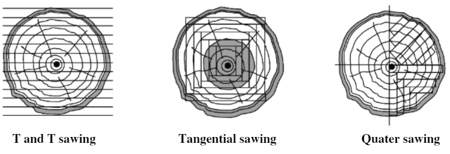
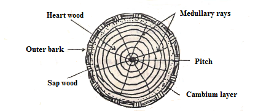

=============================================
Chapter 4: Methods conversion of Lumber (Log)
=============================================

Definition and purpose
======================
    
Conversion of wood or lumber can be defined as the process of cutting the wood into marketable forms like usable planks or boards. Before the wood is converted, it must be processed and seasoned first. 
The purpose of this conversion is to get most out of log minimizing waste and to convert big logs into hand-able forms. Log, balk, plank, board, batten and scantlings are some of the marketable forms of woods after conversion. 

|
|
|

Methods of conversion
=====================

When logs are taken to the mill, they may be cut into variety of ways and they are:

#. **Through and through sawn (T and T)**
    Here, a number of parallel saw cuts are made into the log. It is also called plain sawn or slash sawn or flat sawn. It is a cheaper and faster method with very little wastage. Planks of maximum width are obtained. And it is not suitable for structural timbers because shrinkage tends to wrap and split the boards

#. **Tangential sawn**
    In tangential sawing, boards or planks are sawn tangentially to the annual rings. Annual growth rings form an angle less than 45 degrees. The problem of rejection is reduced but cupping problem is still there.

#. **Rift or quarter sawn**
    In this conversion method, each log is ripped into quarters as shown in figure. Annual growth rings form an angle greater than 45 degrees. The defect of wrapping i.e. cupping us eliminate. Cupping is the wrapping of the plank away from the heart of the tree.

   	Figure 4-1. Different methods of conversion

|
|
|

Cross-sections of a Trunk
=========================

A tree trunk consists of the following:

.. topic:: 1) Outer bark

    The bark is living and growing only at the cambium layer.

.. topic:: 2) ``Inner bark``

    In some trees like hickories and basswood, there are long tough fibers (i.e. bast fibers) in the inner bark. In other trees like beech, these bast fibers are absent.

.. topic:: 3) ``Cambium layer``

    This can be only one cell thick which are living and growing.

.. topic:: 4) ``Medullary rays or wood fibers``

    These run radially from the center to the bark.

.. topic:: 5) ``Annual rings``

    These are layers of wood.

.. topic:: 6) ``Pith``

   This is at the very center.

   	Figure 4-2. Cross-section of tree trunks

|
|
|

What's next?
============

We'll dive into Carpentry tools in the `next chapter`_.

.. _next chapter: chapter05.html
