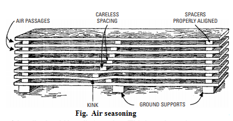
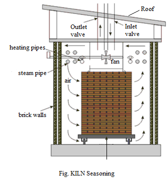

===========================
Chapter 6: Timber Seasoning
===========================

Definition and purpose
======================

Seasoning of timber is the process of removing moisture or sap from freshly cut down trees. The percentage of moisture is very high in freshly felled trees which may cause problems like shrinkage and distortion. It is the initial step for timber utilization.
The purpose of timber seasoning are as follows:

| 1) **To increase resistance against insects and fungus.**
|
| 2) To increase the durability and strength.
|
| 3) **To increase resistance against fire.**
|
| 4) To reduce the timber weight and make lighter.
| 
| 5) **To minimize the distortion and shrinkage.**
|
| 6) To improve timber surface to be painted, polished and preserved
|
| 7) **To improve workability or working quality of timber.**

|
|
|
|

Object of seasoning 
===================
Properly seasoned timber will not crack, wrap or shrink, if protected from weather. The main objectives for seasoning are as follows:

| 1) **To minimize the tendency of timber to shrink, wrap and split.**
|
| 2) To make timber suitable for gluing.
|
| 3) **To make timber ease for workability.**
|
| 4) To reduce timber weight for transportation. 
|
| 5) **To free timber from threat of fungi and insects.**
|
| 6) To boost strength and durability of timber.
|
| 7) **To increase insulating capacity (i.e. electrical resistance) of timber.**
|
| 8) To increase heat content. Heat content of green wood has a heat content or calorific value of only 6 to 7 MJ/kg. Dry wood has a calorific value of 16 to 19 MJ/kg. In addition to giving more heat, seasoned wood ignites more easily and burns better, with less smoke.
|
| 9) **To suit timber for various surface treatments like painting, polishing and preserving.**

   
|
|
|
|  
    

Methods of seasoning
====================

Seasoning of timber is done in either artificial or natural ways. Some of the seasoning methods are listed below:

1) Natural seasoning
--------------------

a) Air seasoning
~~~~~~~~~~~~~~~~

    In this method of seasoning, sawn timber is stacked in a dry place about 30 cm above floor level and two pieces are kept about 40-50 cm apart which makes it possible for free circulation of air. It should not be kept in direct sunlight and in wet environment.
    
    Advantages: Simple and cheaper and requires less attention.

    Disadvantages: Very slow process, more space is required, threat of insects and fungi during seasoning.

   	Figure 6-1. Air seasoning

b) Water seasoning
~~~~~~~~~~~~~~~~~~
    In water seasoning, logs are completely immersed in running stream of water for about one month.  The sap, sugar, gum and other unnecessary materials are removed and replace by water.

    Advantages: Quick process, boosts drying process, shrink and wrap problems are minimized and wood becomes less prone to insects or decay.
    
    Disadvantages: Reduction in elasticity and durability

|
|
|
|

2) Artificial seasoning
-----------------------

a) Kiln seasoning
~~~~~~~~~~~~~~~~~
    In kiln method, the timber is seasoned under controlled environments with proper air circulation and ventilation system. The wooden pieces are stacked carefully in huge trollies and then placed inside the brick kiln according to wooden moisture level. Then, water is heated and resulting steam circulates inside and around the wood boards. With time, the amount of steam is reduced until the desired moisture level is achieved in wood. Although seasoning is done in lesser time (i.e. about 2 weeks), the quality of wood is inferior when compared with naturally seasoned wood.

   	Figure 6-2. Kiln seasoning

b) Chemical/salt seasoning
~~~~~~~~~~~~~~~~~~~~~~~~~~
    In chemical seasoning, the timber is totally submersed in a suitable salt solution which has the tendency to absorb water from the timber. Then, timber is allowed to dry after moisture content is removed. It reduces the chances of formation of external cracks because internal surface of timber dries before external surface.

c) Electrical seasoning
~~~~~~~~~~~~~~~~~~~~~~~
    In electrical seasoning, the timber is subjected to high frequency alternating currents. The resistance of timber is measured at certain interval of time. And when the required resistance is reached, seasoning process is stopped because resistance of timber increases by reducing moisture from timber. It works in a simple idea that *heat is produced when poor conductors are placed in the field of high frequency*. Although this process gives superior quality of timber, it is not commonly used because of its high cost and lack of control of moisture content.

3) Combined seasoning
---------------------

    In combined seasoning, combination of different seasonings is employed for better timber. For example, solar seasoning is the combination of air and kiln seasoning.

|
|
|

Moisture meter
==============

    A moisture meter gives approximate reading of moisture present in wood. It provides fast solution to determine which wood is suitable as per the requirement. The back of the meter or some pointer is place over the surface of wood, then moisture meter gives record of the approximate moisture level present in that wood 

    .. figure:: images/c6-3.jpg
    	:alt: Image of Moisture meter

       	Figure 6-3. Moisture meter

|
|
|

Calculation of moisture content in timber in percentage
=======================================================

The percentage of moisture content in timber is calculated using two ways.
    1) **Using meter**
    2) **Using seasoning techniques**

The formula to calculate the moisture content in timber is. ::
    
    MC = [ ( WW - DW ) x 100 ] / DW

| Where, MC = Moisture content,
|        WW = Weight of wet wood and 
|        DW = Weight of dry wood

.. code:: console

    For example, Find the moisture content of a tree whose weight before seasoning is 20 grams and after seasoning is 15 grams.

    Here we have,
                WW = 20 grams
                DW = 15 grams
                MC = ?

    We know that,
               MC = [ ( WW - DW ) x 100 ] / DW
                  = [ ( 20 - 15 ) x 100 ] / 15
                  = [ 5 x 100 ] / 15
                  = 33.33 %
    Therefore, moisture content in given wood is 33.33 percentage.

|
|
|

What's next?
============

Now we will learn about different defects that hampers timber in `next chapter`_.

.. _next chapter: chapter07.html