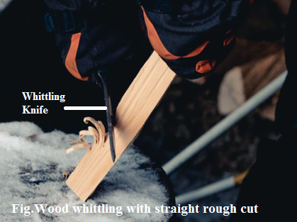
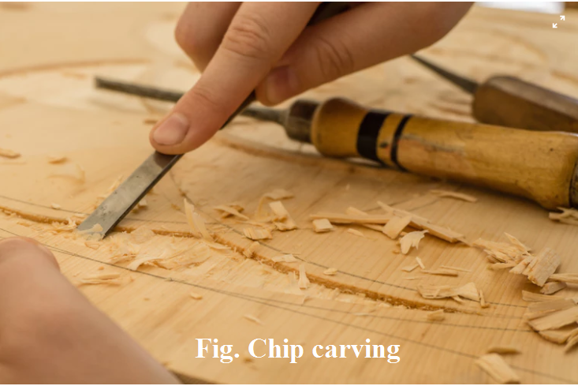
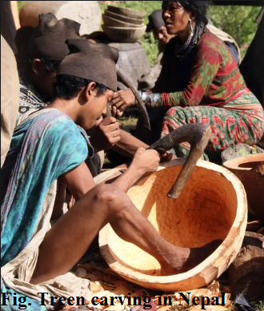
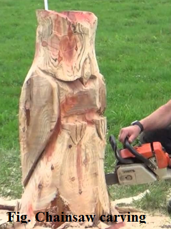
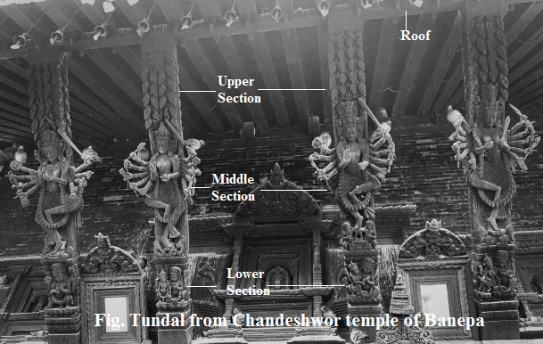

========================
Chapter 09: Wood Carving
========================

Definition of carving
=====================
It is the art of fashioning or ornamenting objects of wood by cutting with different sharp handheld tools. Some examples of world-famous wood carvings are 
  
    * The Shigir idol (Russia, 11500 years old)
    * Rottgen Pieta (Germany, 1300 CE) 
    * Holy Blood Altar (Germany, 1499-1504)
    * Durbar squares in Kathmandu, Patan and Bhaktapur (Nepal, 1200 CE)
    * Sky Cathedral (America, 1958) etc.
    * Simraungadh

|
|
|

Process of carvings (Method)
============================
Some methods of carvings are as follows:
    #. Whittling
    #. Relief carving
    #. Chip carving
    #. Chainsaw carving
    #. Treen

1) Wood whittling
-----------------
Whittling is an art of wood carving made out of raw wood using a whittling knife. Softwoods with straight grains are best for whittling because they cut easy and nice. You can use woods like basswood, pine, Balsa and random branches. Similarly, pocket knives or special whittling knives are used for sculpting wooden workpiece. It involves sharpening your tool time to time to make whittling experience relaxing. Make sure you are making cuts in the direction of grain since cuts made with the grain will peel away smoothly. There are various ways of making cuts while whittling:
    • Straight Rough cut is made like sharpening pencils where blade is pushed away from yourself.
    • Pull stroke or Pare cut is made by pulling blade towards you.
    • Push Stoke is done by placing both left and right thumbs on the back of the knife blade where left thumb push blade forward and right thumb guide the blade through wood for detailed cuts. 

   
   Figure 9-1. Wood whittling

2) Relief carving
-----------------

Relief carving is the process of removing unnecessary wood from flat wooden panel in such a way that an art form appears to rise out of wood. It creates a sculpture with illusion of space and depth on a wooden surface. The depth of the carving distinguishes the relief carving; a high relief stand out from the surface with greater depth compare to low relief. Initially, use a pencil to draw a design onto the wood. The background should be started first by defining outline patterns with stop cuts. Then, use a gouge to carefully remove excess wood and establish relief or deepest part of the background. 

   
   Figure 9-2. Relief carving of Buddhist goddess Tara

3) Chip carving
---------------

Chip carving is a process of removing crust of material or chip with a chisel and mallet to reveal the inner layer. The difference between the material chipped away compared to the remaining surface creates a chip carve pattern. The types of chip carving patterns are:
    • Fine triangle chip carving pattern is created from triangular shapes.
    • Free-form chip carving pattern is created by making fine cutlines of different shapes from various directions. 

   
   Figure 9-3. Chip carving on wood

4) Treen carving
----------------

This type of carving means the carving of household items with wood. Some carving considered as treen are wooden plates, bowl and spoon and snuff boxes. It is replaced by silver, plastic and ceramics material in modern times but treen is one of the collectives due to its beautiful and tactile appearance.  

   
   Figure 9-4. Treen carving on wood by man from Raute community

5) Chainsaw carving
-------------------

It is the modern version of woodcarving with the help of chainsaw.  It involves a chainsaw and a wood piece. It started in 1950s and got big breakthrough during Lumberjack World Championships of 1980s. Different types of arts like decorates, chair, horses, tables, benches and bookshelf are created using this method. 

   
   Figure 9-5. Chainsaw carving on wood 

|
|
|

Illustration of ancient carving of Tundal and Shutters
======================================================

Tundal are the ancient carved wooden pieces found just below the roof of temple, monastery or residencies in different artistic forms. Tundals are placed diagonally in beam to support the long-slanted roof. Most of the tundal in Nepalese society are carved representing the spirituality, sexuality and cultural norms practice in society. Objects caved in tundals can be animals, demigods, humans and natural elements. Tundal shows the event of particular subject in sequential pattern running from one corner. For example, the tundal in Lord Vishnu temple can shows all of his incarnations in sequential order. Generally, Tundal is divided into three sections and they are upper, middle and lower. There is a popular belief in Nepalese community that the temple carved with tundal is not hit by lighting. Tundal symbolism and design pattern makes this ancient Nepalese artform an object of importance.

   
   Figure 9-6. Wooden tundal of Chandeshwor temple

|
|
|

What's next?
============

We'll dive into preserving abd beautifying wooden items in the `next chapter`_.

.. _next chapter: chapter10.html