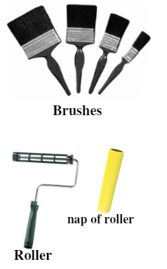
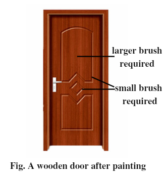

=======================================
Chapter 10: Painting on Wooden Surfaces
=======================================

Definition of wood primer
=========================

A wood primer is a preparatory coating used on interior or exterior unpainted wood before paint is applied on it. It provides penetration and sealing properties on wood and prevents paint from being absorbed on wood.

|
|

Definition of wood varnishes/enamel and French polish
=====================================================

1) Varnishing
-------------

A varnish is a resinous matter dissolved in an oil (oil varnish) or in alcohol (spirit varnish) and other volatile liquid. Varnishing is a process of applying varnish to the surface of wood which leaves a hard, beautiful and transparent protective finish or coating.

Varnishing is done in violin, tables, guitar, chairs and kitchen cabinets.

2) Enameling
------------

Enamel paint gives a hard, glossy and opaque finish so it is perfect for coating surfaces that must endure humidity and high traffic surfaces found inside and outside homes. It provides excellent color retention and coverage. It is commonly used in wood surfaces because of its waterproof and rot resistant properties.

Enameling is done in doors, window frames, table and chairs, architraves and skirting

3) French polish
----------------

French polish is not a material but a wood finishing technique. Its was named after two French brothers who invented the method of transferring Shellac onto wood. Shellac is the material used for finishing and results in a high gloss surface with mirror-like shine. This kind of technique is used in guitars and other wood instruments. Three ounces of shellac flakes is mixed with 1 pint of denatured alcohol, then the mixture is applied in the wooden surface with the help of cotton cloth. 

4) Cleaning work piece
----------------------

Cleaning of work piece can be done in various ways and they are:

.. topic:: a) Hot wash

    Hot wash is done with the solution prepared mixing a gallon of water with 2 tablespoons turpentine and 4 tablespoons of boiled linseed oil. Wring the soft clean cloth in the prepared solution and wash the wood. It removes soil, oil, and built up waxes and polishes. 
    

.. topic:: b) Ammonia wash

    Ammonia wash is done with the solution with 20 percent of ammonia and rest is water. Wring the clean rag and wipe the work piece surface. It discolors or clouds the wood finish.
    

.. topic:: c) Mineral spirit wash

    Mineral spirit wash is done by applying paint thinner or mineral spirits on a clean soft cloth and rub that cloth on wood surface to dissolve polish, wax, oil and greasy grime. It does not dissolve paint and is cost-effective.
    
    
    
5) Sanding work piece
---------------------

Sanding is the process of removing materials from wooden surfaces in small amounts with an abrasive to create an even surface and enhance wood appearance. Sandpaper is commonly used for sanding purposes and are available in different grit sizes like coarse grit, medium grit, fine grit, very fine grit and micro grit. Always start with lower grit sandpaper before moving to higher grit sandpaper. Sanding of work piece is done manually or using a power tool called sander. Cleaning is necessary after the sanding is done.

6) Putty applying
-----------------

While repairing furniture or building from scratch, imperfections like nail holes are need to be filled using wood putty. Wood putty, also called as plastic wood is composed of wood dust, binder, diluent and pigment and it is applied after varnishing your workpiece. It is the best filling agent for outdoor furniture since it makes furniture resistant to shrinkage and effects from sun and rain. Care should be given while selecting the color of wood putty compare to the color of woodpiece.

7) Primering
------------

Primering is the process of applying primer in wooden surfaces which provides consistent base for topcoats of paint. It is must before applying paint in any wooden workpiece since it does not allow paint to soak into and helps to hide joints and prevents bleed-through from knots. Similarly, primer helps to seal mold stains and other discoloration to prevent them from showing through the finish coats of paints. Also, primer is necessary for making proper bond with the paint. Primers can be both oil-based primers and water-based primers used for various purposes.

8) Drying
---------

Once you have painted your workpiece, time required for paint to dry depends in factors like type of paint used, thickness of paint coating, humidity and temperature of environment and ventilation system. When solvent evaporate from paint coating leaving the paint dry enough to touch although it is not 100% dry is called paint dry. Paint cure happens when paint coating reached its maximum hardness and is completely 100% dry.  Water based or latex paint takes dry time of about 2 hours and cure time of about 30 days. And oil-based paint takes about 8 hours of dry time and cure time of about 30 days.

9) Thinner (Licened oil, Turpentile oil and Sprint)
---------------------------------------------------
Thinner is also known by its different names like diluent or filler. Thinner are normally used to remove oil-based paints from brushes, rollers, equipment and wooden surfaces. Paint thinner is used to thin or reduce the viscosity (i.e. the state of being thick and sticky) of paint. Similarly, thinner can also be used to prevent paint from hardening when it is left in open.

|
|
|

Identification of painting brushes/rollers
==========================================

A good painting does not depend only on paint you used but also on painting brushes used. By applying right brushes and rollers, any job can be done easily with high-quality coverage and a better finish.

   
   Figure 10-1. Brushes and paint roller

.. note:: Painting brushes are categorized in two groups:
    
    1) Brushes made of natural hair bristles which are used for oil-based paints.
    
    2) Brushes made of synthetic materials like polyester which are used for water-based paints.

   
   Figure 10-2. A wooden door after painting

Similarly, you need to choose a brush with different shape and size according to your job. 

 
    |
    | 1) Smaller angled brushes are used for cut and trim painting job.
    |
    | 2) Larger brushes are used for painting larger areas of woodpiece surface.
    |
    | 3) Flat brushes are used for molding painting job.

Before buying any brushes, you have to careful about its quality and workability. *Tug on the bristles of brush and if one or more bristles are pulled out, the brush is of low quality*. Also, hold the brush in different position to make sure it is comfortable to work with.

To paint larger surface in fast pace and with ease, paint rollers are chosen over brushes. A smaller roller is used for trimming or narrow area whereas larger rollers are used for larger areas like ceiling and floors.

.. note:: Rollers are available as:

    1) Short-nap roller is used in painting smooth wood workpiece.
    2) Longer-nap roller is used in painting wood with rough surface. 

Before buying any rollers, you need to consider to test its quality. *Squeeze the roller cover and if the roller cover quickly returns to its original shape then it is of high quality*. Likewise, you need to choose the paint roller with right thickness of the roller according to your project.

Paintings with brush and rollers can result in drips and brush marks, spray paint can be the ideal solution for that. Once the workpiece is gone through sanding, cleaning and premiering, paint is sprayed from medium distance using paint spray gun.

|
|
|

Safety precautions
==================

The safety precautions needed to be followed by a painter are as follows:

.. topic:: Always keep these things in mind before painting:

    #. Always wear rubber gloves and apron while painting.
    #. Never use paint and varnish remover around the flame since some are highly flammable.
    #. If paint or other chemical touch your skin, particularly face, mouth and eyes, clean immediately with cold water and seek medical attentions as soon as possible.
    #. Do not use turpentine or mineral spirits to remove paint from hand because they are absorbed through skin pores. Used soap and water for that purpose.
    #. Make sure you have adequate ventilation and approved paint respirator. In case of dizziness, leave the painting area and get the fresh air.
    #. Do not wear nylon, orlon or plastic clothing because these clothes generates static electricity which may spark and ignite paint vapors.
    #. Do not paint during electrical storms.
    #. Keep food and drinks away from workplace.  
    #. Do not smoke or use spark-producing tools in the vicinity of painting operations.
    #. Give the painted workpiece enough time to dry and use only after it is dried or cured.
    #. Keep children and pets away from painted area and equipment.
    #. Wash the brushes and rollers properly after use and hang them safely.

What's next?
============

We'll dive into wood joints useful for a carpenter to manufacture or repair any furnitures in the `next chapter`_.

.. _next chapter: chapter11.html