==============================================
Chapter 11: Simple and Complicated Wood joints
==============================================

Definition and purpose
======================

A wood joint is a point in a wooden structure where components of structure are connected. The joints in wooden workpiece are made with the help of dowels, nuts, bolts, screws etc. Joints can be simple and complicated based on requirement.

The purpose of joint in woodworking is to join wooden parts together so that the overall structure remains stable.

The main function of wood joints are as follows:

    * To support load transmission.

    * To let the wood expansion and contraction with change in temperature and humidity.
    
    * To provide suitable gluing surface for fasteners.

|
|
|

Types of joints 
===============

In order to obtain a successful design, you need to know the right woodworking joint and know how to make that joint in a right way. There are different types of joints available in carpentry work and they are:
   
1) Lengthening joint
--------------------

    This type of joint is used when effective length of workpiece is needed to be increased. The types of lengthening joints are	lapped joints, scarfed joints, fished joints, beveled halved joint, dovetail halved joint, keyed joint, wedged joint and screwed joint.

2) Widening joint
-----------------

    This type of joint is used when width of workpiece is needed to be widen. The types of widening joints are rubbed joint, slot screwed widening joint, dowel joint, biscuit joint and tongued and grooved joints.

3) Framing joint
----------------

    Framing joints are used to terminate or to change the direction in wooden structures. The types of framing joints are mortise and tenon corner joint, rafter scarf joint, butt joint hammer beam truss detail and pegged bladed scarf joint.

|
|
|

Miscellaneous joints
====================

1) Cross half lap joint
-----------------------

    A half lap joint is formed by fitting two boards (with half of their material removed) together perpendicularly in such a way that the joint does not add thickness at the joint.
    It is used while building furniture like dressers and desks.

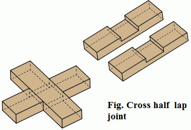
   
   Figure 11-1. Cross half lap joint

2) Dovetail half lap joint
--------------------------

    This joint is formed by two boards (with half of their material removed) of equal thickness where one board with a dovetail is fitted into a corresponding mortise in the second board. It is used when more strength is needed.
    It is used in building jewelry boxes, dovetail drawers and cabinets.

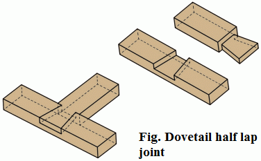
   
   Figure 11-2.  Dovetail half lap joint

3) Dado joint
-------------

    A dado joint is a formed by three-sided channel cut across the grain of one workpiece. Another mating workpiece is placed to fit into the slot. It is one of the strongest woodworking joints which made with the help of table saw or router.
    It is used to build cabinet and bookshelves.

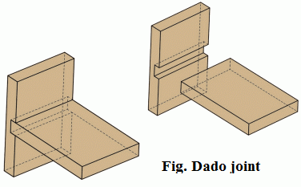
   
   Figure 11-3.  Dado joint

4) Mitred joint
---------------

    Two or more members are cut at different angles and this type of members are joined together to form metred joint. 
    It is used mostly in photo frames.

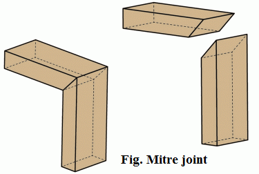
   
   Figure 11-4.  Mitred joint

|
|
|

Types of beam hangers
=====================

A beam is made of solid lumber one or more pieces usually placed horizontally to the ground. Joists are the lumber pieces attached to beam in order to frame the structure and also to handle pressure. Beam hangers are used to attach joists with a beam in any structural construction. Sometimes, beam hangers are also known by joist hangers. 
    
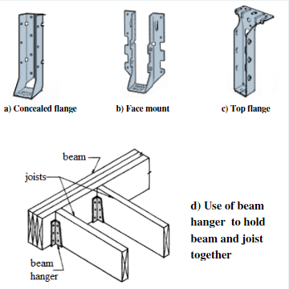
   
   Figure 11-5.  Use of beam hanger to hold beam and joist together

1) Face mount hanger
--------------------

    In face mount hanger, face nails are installed with at least half of the required fasteners in the top half of the header.  The supported member hangs either partially or entirely below the header.

2) Top flange hanger
--------------------

    In top flange header, face nails must be driven straight so that they penetrate through the corner of the joist and into the header.

3) Concealed flange hanger
--------------------------

    It can be used to attach the joists to the beam in such areas where it is difficult or impossible to do so. It provides strong and attractive connection

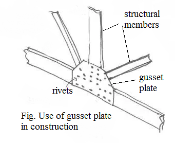
   
   Figure 11-6.  Use of gusset plate in construction

|
|
|

Use of gusset plates in framing of frame construction
=====================================================

Gusset plates are made of wood, metal or steel which is used to connect beams and griders to column. Wood gusset are used for wooden truss constructional works and they are generally made of plywood. Similarly, steel gusset is used in steel structural buildings and in wood beam construction. 

Gusset plates are used mostly in framing of frame construction.

    1) A **gable-end overhang** can be framed by ordering a gable-end truss which placed to permit lookouts to rest on top of it and run to the top chord of the next truss.
    
    |

    2) A **hip roof** can be framed with roof trusses using a step-down system. It uses a series of intermediate trusses and a glider truss which carries the load of a series of common jack truss. A hip jack truss is used to form the runs from the hip grider truss to corner of the building. 

|
|
|

Uses and application of:
========================

1)  Lengthening joint
---------------------

a. Table scarf joint
~~~~~~~~~~~~~~~~~~~~

    It is the method of joining two wooden members end to end as shown in figure. It is preferred over other wood lengthening joints because it results with barely visible glue line.
    
    Its applications are:
        * To connect or elongate lumbers in big constructions
        * To connect the wooden beams.
        * For construction of barns and sheds.

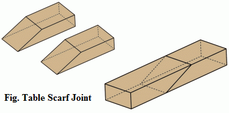
   
   Figure 11-7.  Table scarf joint

b. Spliced joint
~~~~~~~~~~~~~~~~

    It is also the method of joining two wooden members end to end as shown in figure. It is preferred over other wood lengthening joints because it results with stronger joints.
    
    Its applications are:
        * To join lumber structure end to end.
        * To make joints where mechanical fasteners like bolts are used.
        * To construct the building materials like skirting and architrave from smaller offcuts of timber.
        * To make interlocking surface so that joint resist being pulled apart.

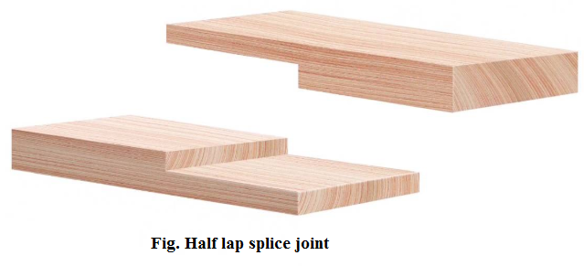
    
    Figure 11-8. Half lap spliced joint

2) Widening joint
-----------------

a. Butt joint
~~~~~~~~~~~~~

    A butt joint is formed by placing ends of two members togethers without any special shaping or cuts. It is simplest joint as well as weakest. So, butt joints are used with reinforcements.
    
    Its applications are:
        * It is used in framing in constructions of door, table or chair legs, face frames etc.
        * It is used in wood toys.
        * It is used in carcase construction like cabinet and drawer boxes.
        * It is used in panel assembly.

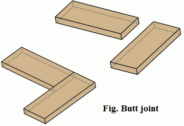
   
   Figure 11-9. Butt joint

b. Tongued and grooved joint
~~~~~~~~~~~~~~~~~~~~~~~~~~~~

    A tongued joint is formed by joining two members together where one member has a slot or groove cut all along the edge and other member has a deep ridge or tongue cut all along the edge. It is used to form wider panels from narrower boards. It provides a tight fit with plenty of surface area for adhesives.    
    
    Its applications are:
        * It is used where seasonal expansion and shrinkage of timber occurs due to moisture and temperature.
        * It is used to form wider panels from narrow boards like table tops, doors and architectural paneling.
        * It is used for strip flooring or plywood flooring.
        * It is used in  floorboards,  lining boards,   wood paneling and table tops

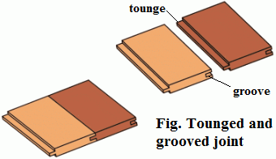
   
   Figure 11-10. Tongued and grooved joint

c. Dowel joint
~~~~~~~~~~~~~~

    Dowels are round wooden pins of small diameter made from hard wood used to strengthen a joint. Dowels are dipped in glue and driven at a tight fit into dowel holes. Dowel joints are formed by inserting the dowels in dowel holes which are drilled with perfect alignment so that dowels are fitted in straight fashion.
    
    Its applications are:
        * To construct the furniture like doors, windows, photo frames and tables.
        * It is used to strengthen the joints like butt to hold wood members more strongly.
        * Dowels are thick and sturdy than nails which makes them less prone to breakage.
        * It is used to build cabinets, wooden shelves and racks.
 
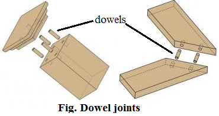
   
    Figure 11-11.  Dowel joint

3) Framing joint
----------------

a. Dovetail bridle joint
~~~~~~~~~~~~~~~~~~~~~~~~

    Bridle joints are formed when a tenon on one member is joined with a mortise in the other member of workpiece. It is similar to mortise and tenon joint except tenon and mortise are not cut in full width in bridle joint.
    
    Its advantages are:
        * It is used in constructing different frames.
        * It is used in making furniture like chairs and tables.

b. Tusk tenon joint
~~~~~~~~~~~~~~~~~~~

    To join two different members of wooden workpiece, a tusk tenon is passed through a tenon mortise and a wedge is place in wedge mortise to make joint stronger. 
    
    Its applications are:
        * It is used in construction to join one beam to another.
        * It is used for making things like doors, tables, windows and beds.
		
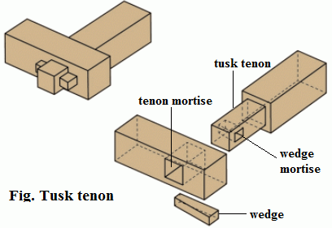
   
    Figure 11-12.  Tusk tenon joint

4) Rail joint
-------------

a. Stub mortise and tenon joint with hunch
~~~~~~~~~~~~~~~~~~~~~~~~~~~~~~~~~~~~~~~~~~

    A mortise and tenon joint are formed when rectangular end (the tenon) of one member fits into a rectangular hole (the mortise) of another member having the same size. It is the most commonly used joint.  Stub mortise means the mortise that does not pass through the wood member.
    
    Its applications are:
        * This joint is used for construction like building bridges, monuments, shelters and temples.
        * This joint is used for making furniture like tools, sculpture, tables, railings and doors.

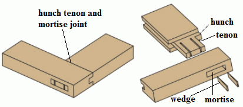
   
    Figure 11-13.  Mortise and tenon joint

b. Housing joint
~~~~~~~~~~~~~~~~

    Housing joint are by joining two members where one member has a slot in the surface wide enough to fit the second member to fit in as shown in figure. The second member or shelf is then glued or nailed with dowels. For clean finish you can apply stopped housing joint. 
    
    Its applications are:
        * It is used to make back of drawers because it is strong withstands stress from many directions.
        * It is used for fibreboard joints like partile board.

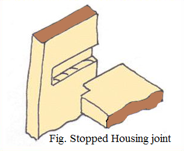
   
    Figure 11-14.  Stopped housing joint

|
|
|

What's next?
============

In `next chapter`_, we will learn about plywood and how they are made.

.. _next chapter: chapter12.html
