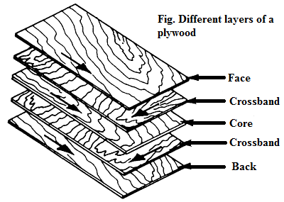

===================
Chapter 12: Plywood
===================

Definition
==========

Plywood is a glued wood panel where several thin layers of wood or veneer or plies are cemented together. Wood veneers are thin slices or sheets of quality woods like teak. The outer plies are called faces, the inner plies are called cores and the plies just below the faces (both front and back face) are called crossbands. Lumber, veneer or particleboard can be used as the core. The plywood varies based on thickness, species, grade of wood and number of plies used. The quality of plywood depends upon the glue used, quality of different layer of veneer, the order of layer placement in the panel and the control of gluing condition during gluing process.

    
    Figure 12-1. Different layers of plywood

Plywood are made in two different ways:
    
    * Hot pressing method uses large hydraulic presses to press the required number of plies together
    
    * Cold pressing method can be operated within room temperature.

Plywood are used mainly in furniture construction, doors and windows, flooring and ceilings, partitions, fencing, makes packages and boxes, aircraft construction and so on. 

|
|
|

Types
=====

There are numerous ways in which plywood is classified and these classifications are based on various aspects of plywood such as wood used, the number of piles it has, suitability for indoor and outdoor use and grading. 
Two types of plywood based on wood are as follows:

    #. Hardwood plywood
    #. Softwood plywood

1) Hardwood plywood
-------------------

Hardwood plywood is generally used where strength, stiffness and constructional convenience are more is more important than appearance. Most of the hardwood plywood production is intended for interior or protected uses. This type of plywood is made from angiosperms or flowering plants like birch, gurjan or teak. Applications of hardwood plywood are used in constructing musical instruments, furniture, sports equipment, floor/wall/roof of vehicles or containers and so on. 

2) Softwood plywood
-------------------

Generally, softwood plywood is used for constructional and industrial uses where appearance is more important than appearance. Face and back of softwood plywood are selected with clear natural finishes or with pigmented finishes. It is made from gymnosperms or non-flowering plants that have enclosed seeds like pinecones, fir, spruce, redwood etc. Its applications are in home constructions, fencing, packages and boxes and constructing internal parts of vehicles.

|
|
|

Sanding
=======

Sanding is the process of making rough plywood surface into smooth or polish surface by rubbing it with sandpaper or a mechanical sander. To give appearance of real wood you need to apply protective polyurethane or stain the plywood. But sanding of plywood to obtain smooth surface is necessary before you proceed for coating.
Follow the following steps to sand the plywood:

|
| 1. Make sure there is not any dirt or dust present in plywood surface.
|
| 2. Make sure you have sand papers with various grits.
|
| 3. Employ 180- grit sandpaper and stroke or pass it over plywood surface in the grain direction up to 3 or 4 times. 
|
| 4. Now employ 200-grit sandpaper to sand the plywood 3 to 4 stokes. It smoothens the lines created by 180-grit sandpaper.
|
| 5. Again, sand the plywood with 220-grit sandpaper and make up to 2 stokes. It gives the extra smooth plywood surface as final finish before applying coatings.
|
| 6. Finally, clean the plywood surface with clean cloth to remove the dust formed when sandpaper was rubbed in plywood surface.

|
|
|

Properties of plywood
=====================

Some properties of plywood are as follows:

#. It has high resistance to splitting, cracking and warping.
#. It has light weight and uniform tensile strength.
#. It is available in different sizes.
#. It is cost effective and easy to work with.
#. It has smooth surface and better appearance
#. It provides high thermal and sound insulation.
#. It can be used as fire resistance employing chemical coating.
#. It does not corrode.

|
|
|

What's next?
============

This will be the end of our journery. To dive deep in the carpentry field there are lots of resouces available...
